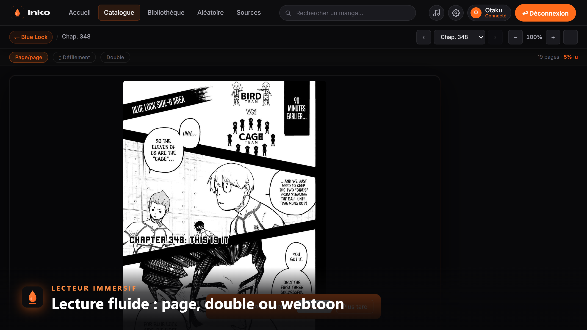
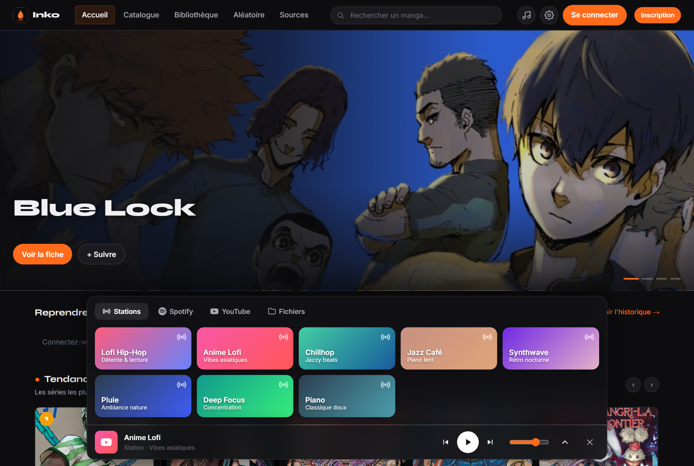
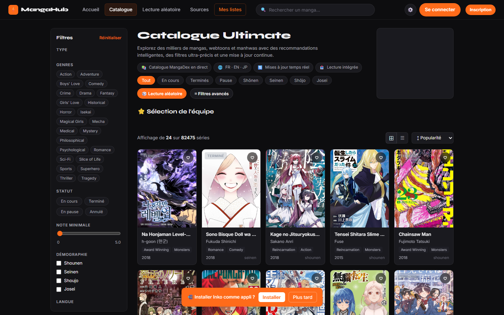
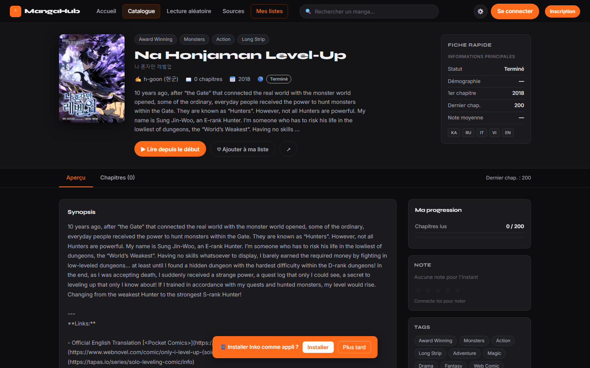

<div align="center">


# Inko

**Tes mangas, light novels et livres, partout. Lis, suis tes séries, note ce que tu ressens, reprends où tu t'es arrêté.**

Un lecteur de **mangas, romans et livres** auto-hébergeable — web, PWA installable,
application desktop (Electron) et mobile (Capacitor) — construit sur un système
d'extensions ouvert, dans l'esprit de Mihon / Tachiyomi. Lis des mangas en images,
des light/web novels traduits **et** des classiques du domaine public (Project
Gutenberg), avec journal de lecture privé, notifications push de nouveaux
chapitres, profils publics et import de tes propres fichiers EPUB/CBZ/PDF.

[](https://nodejs.org/)
[](https://expressjs.com/)
[](https://www.mysql.com/)
[](https://web.dev/progressive-web-apps/)
[](https://www.electronjs.org/)
[](LICENSE)

[Démarrer](#installation-en-2-minutes) · [Fonctionnalités](#fonctionnalités) · [Design](#design--lédition-washi) · [Extensions](#extensions) · [Desktop](#application-desktop) · [API](#api-rest)

</div>

---

## Aperçu


<table>
<tr>
<td width="50%"></td>
<td width="50%"></td>
</tr>
<tr>
<td width="50%"></td>
<td width="50%"></td>
</tr>
</table>

---

## Pourquoi Inko

|  | **Inko** | Mihon | Suwayomi | Komga/Kavita | Sites de scan |
|---|---|---|---|---|---|
| Mangas **et** romans **et** livres | ✅ | ❌ (mangas) | ❌ (mangas) | ✅ (fichiers) | ❌ |
| Extensions multi-sources | ✅ (simultanées) | ✅ | ✅ | ❌ | ❌ |
| Journal de lecture privé | ✅ | ❌ | ❌ | ❌ | ❌ |
| Notifications push nouveaux chapitres | ✅ (app fermée incluse) | ✅ (mobile) | ❌ | ❌ | ❌ |
| Web + desktop + mobile + PWA | ✅ | ❌ (Android) | ✅ (web) | ✅ (web) | ✅ |
| Import local EPUB/CBZ/PDF | ✅ | ✅ | ❌ | ✅ | ❌ |
| Auto-hébergeable | ✅ (Node/MySQL) | ❌ | ✅ | ✅ (lourd) | ❌ |
| Sans pub, sans télémétrie | ✅ | ✅ | ✅ | ✅ | ❌ |

---

## Fonctionnalités

### Lecture
- **Lecteur manga** : page/page, défilement (webtoon), double-page, sens de
  lecture RTL/LTR, zoom, plein écran, mode immersif, défilement automatique,
  gestes tactiles (swipe de page, double-tap zoom), navigation clavier complète,
  préchargement du chapitre suivant, partage de chapitre, téléchargement hors-ligne
- **Lecteur de romans** : typographie réglable (police/taille/largeur/thème),
  synthèse vocale (TTS) avec surlignage du paragraphe lu, progression fine
- **Import local** : EPUB (TTS + navigation clavier + reprise), CBZ
  (décompression parallèle), PDF (pdf.js) — progression sauvegardée partout
- **Environnement du lecteur toujours sombre**, quel que soit le thème de l'app

### Journal de lecture *(nouveau)*
- **Notes privées pendant la lecture** (touche `J`) : capture automatique du
  contexte (série · chapitre · page), humeur (8 étiquettes), édition/suppression
- **Page « Journal »** : toutes tes notes groupées par série en timeline,
  recherche plein texte, statistiques (humeur dominante)
- **« Mon avis »** par œuvre sur la fiche série, en plus de la note en étoiles
- Tout est **privé par défaut** et synchronisé sur ton compte

### Bibliothèque & suivi
- Étagère unifiée : rangée « Reprendre où j'en étais », signaux directement sur
  les cartes (badge non-lus, corne de page pliée si signet/reprise), vue
  grille/liste, sélection multiple avec actions groupées, filtres
  statut/catégorie/source, recherche instantanée, export/import JSON
- **« Mettre à jour » intelligent** : ignore Terminé/Abandonné par défaut,
  affiche les échecs de vérification (source bloquée ≠ série à jour),
  vérification par série depuis sa fiche, garde-fou serveur anti-spam
- **Notifications de nouveaux chapitres** : tâche de fond serveur + Web Push —
  tu es prévenu même app fermée
- Compteur de chapitres non lus **sans plafond** (One Piece 1100+ chapitres : ok)

### Découverte
- Catalogue par source **ou « Toutes les sources » à la fois** (fusion + dédup
  par titre, badge de provenance sur chaque carte)
- Recherche globale multi-sources : live (débounce), dédupliquée par titre,
  badge « Déjà dans ma bibliothèque », suggestions personnalisées
- « Tu aimeras aussi » : recommandations AniList vérifiées sur tes sources
  (lien direct vers la fiche quand l'œuvre y existe), motif affiché
- Hero d'accueil en **3D temps réel** (three.js : particules d'encre, parallaxe)

### Communauté & comptes
- Profils publics, commentaires par chapitre/série (réponses, signalement),
  notes et avis, listes/collections, objectifs et badges, heatmap de lecture
- **Connexion Google (GSI)**, synchronisation **AniList** (progression/statut,
  respectueuse des limites de l'API), lecteur **Spotify/YouTube** intégré
- Admin : modération, rôles, **statut de santé des sources** (dernier succès,
  dernier échec, échecs consécutifs)

### Confort & vie privée
- PWA installable, mode hors-ligne (téléchargements), thèmes Washi (clair) /
  Sumi (sombre) / AMOLED, accent personnalisable, palette de commandes `Ctrl+K`
- **RGPD** : export complet, suppression totale du compte, aucune télémétrie,
  aucune publicité

---

## Design — l'édition « Washi »

Le design d'Inko suit une direction éditoriale précise, pensée comme un objet
imprimé :

- **Le mode clair est la référence** (« Washi », papier `#eeece6`) ; le sombre
  (« Sumi », `#111113`) en est la seconde édition
- **Deux accents fonctionnels, jamais une couleur de marque** : Kakishibu
  `#c1531b` code le manga, Ai `#3d5170` code le roman ; Hanko `#a83232` est
  réservé aux signaux forts (non-lu, destructif)
- **Signature** : la corne de page pliée (screentone dans le pli) sur toute
  couverture qui porte un signet ou une reprise de lecture
- Typographie à 3 rôles : Archivo Narrow (display), IBM Plex Sans (interface),
  Bitter (lecture longue)
- Surfaces flottantes en **liquid glass** (verre translucide, arête spéculaire) ;
  le lecteur, lui, reste strictement sobre

---

## Installation en 2 minutes

Prérequis : Node.js 18+, MySQL 8 (Laragon, MAMP, Docker…).

```bash
git clone https://github.com/Abdoulrazack1/Inko.git
cd Inko/server
npm install
npm run init-db        # crée la base + un compte démo
npm start              # http://localhost:8088
```

| Compte démo | |
|---|---|
| Email | `demo@inko.app` |
| Mot de passe | `demo1234` |

La configuration fine (JWT, CORS, SMTP pour « mot de passe oublié », rate
limiting…) se fait dans `server/.env` — voir [`server/.env.example`](server/.env.example).

---

## Extensions

Les sources de contenu sont des **modules indépendants** (`server/extensions/<id>/index.js`),
installables et **mises à jour en un clic** depuis la page Sources (rechargement
à chaud, sans redémarrer — réservé aux admins). Chaque source peut être testée
(« Tester la connexion »), désactivée, et son état de santé est journalisé.

```js
module.exports = {
  id: 'masource', name: 'Ma Source', lang: 'fr', version: '1.0.0',
  baseUrl: 'https://…', nsfw: false,
  type: 'manga',          // 'manga' (images) | 'novel' | 'book' (texte)
  unit: 'chapter',        // 'chapter' | 'volume'  → affichage « Chap. » / « Tome »
  capabilities: ['popular', 'latest', 'search', 'manga', 'chapters', 'pages'],

  async popular({ limit, offset })                    { /* → MangasPage  */ },
  async latest({ limit, offset })                     { /* → MangasPage  */ },
  async search({ q, limit, offset, filters })         { /* → MangasPage  */ },
  async getManga(id)                                  { /* → Manga       */ },
  async getChapters(mangaId, { lang, limit })         { /* → ChaptersPage — liste COMPLÈTE si pas de limit */ },
  async getPages(chapterId)                           { /* → PagesPayload (manga) */ },
  async getText(chapterId)                            { /* → TextPayload  (novel/book) */ },
};
```

Contrat complet : [`server/lib/source-interface.js`](server/lib/source-interface.js).
Catalogue communautaire versionné : [`extensions-community/`](extensions-community/)
(sources fournies : MangaDex, Weeb Central, SushiScan, Royal Road, NovelFull,
NovelBin, Chireads, Project Gutenberg).

---

## Application desktop

```bash
cd desktop
npm install
npm run dist          # Windows : dist/Inko-Setup-1.0.0.exe (NSIS) + mise à jour
                      # de l'app déjà installée (%LOCALAPPDATA%\Programs\Inko)
# npm run build:win   -> build seul, sans déployer
# npm run dist:mac    -> .dmg        npm run dist:linux -> AppImage + .deb
```

L'app desktop embarque le serveur (il ne manque que MySQL sur `127.0.0.1:3306`).

## Application mobile

```bash
npm install -g @capacitor/cli
npx cap add android && npx cap sync android && npx cap open android
```

---

## Connexion Google & comptes liés

Tout se configure **dans l'app, sans redémarrage** (ou via `server/.env`) :

- **Google (Gmail)** — Paramètres → *Connexion Google* : colle un *OAuth Client ID*
  « Application Web » créé sur `console.cloud.google.com/apis/credentials`.
  ⚠️ **Origines JavaScript autorisées : ajoute LES DEUX** — `http://localhost:8088`
  **et** `http://127.0.0.1:8088` (le desktop charge 127.0.0.1 ; pour Google ce
  sont deux origines différentes). Vide = bouton Google masqué proprement.
- **AniList** — carte de connexion (Paramètres/Profil) : crée un client sur
  `anilist.co/settings/developer` (Redirect URL : `http://127.0.0.1:8088/anilist.html`),
  colle l'**ID client**, puis « Connecter ». La synchro de bibliothèque respecte
  la limite de l'API (~30 req/min) : elle s'espace et reprend seule en cas de 429.
- **Spotify** — `server/.env` (`SPOTIFY_CLIENT_ID` + `SPOTIFY_CLIENT_SECRET`),
  Redirect URI `http://127.0.0.1:8088/api/spotify/callback`. Détails dans
  [`SPOTIFY_SETUP.md`](SPOTIFY_SETUP.md). Sans config, stations/YouTube restent dispos.

Les identifiants collés dans l'app sont stockés localement
(`server/config/*.json`, gitignorés ; ou `inko-config.json` côté desktop).

---

## Architecture

```
Inko/
├── *.html                  # Pages (vanilla JS, zéro framework, zéro build)
├── assets/
│   ├── css/                # global.css (design system Washi/Sumi) + 1 CSS/page
│   ├── js/                 # api.js, global.js, 1 module/page, notes-ui, hero3d…
│   └── vendor/             # jszip, pdf.js, three.js (tout en local, CSP stricte)
├── server/                 # Express + MySQL
│   ├── controllers/        # auth, manga, user, notes, extensions, admin…
│   ├── extensions/         # sources chargées à chaud (contrat Mihon-like)
│   ├── lib/                # mailer, push, notify, updates, source-health…
│   ├── middleware/         # auth JWT, sécurité (CSP/HSTS prod, rate limit)
│   └── db/                 # schema.sql + migrations idempotentes
├── extensions-community/   # catalogue de sources versionné (versions.json)
└── desktop/                # Electron (electron-builder, NSIS)
```

### Déploiement en ligne (Docker)

```bash
docker compose up -d       # backend Node 22 + MySQL 8, HEALTHCHECK inclus
```

En production : `NODE_ENV=production` active CSP/HSTS ; configure `JWT_SECRET`,
`CORS_ORIGINS`, et un SMTP (`SMTP_HOST`…) pour « mot de passe oublié ».

---

## API REST

Base `/api`. Voir le [détail des routes](server/routes/index.js).

```
Auth      POST /auth/register, /auth/login   PUT /auth/password, /auth/profile   POST /auth/delete
Google    GET  /auth/providers   POST /auth/google   GET/PUT /auth/google-config
Sources   GET  /sources    /sources/:id/mangas/*    GET /extensions/updates
          POST /extensions/update (admin)   GET /extensions/:id/test   GET /extensions/health (admin)
Mangas    GET  /mangas/{search,popular,latest,tags,:id,:id/chapters}    GET /search-all
Lecture   GET  /chapters/:id/pages  (manga)    /chapters/:id/text  (roman / livre)
Images    GET  /img?u=<url>         (proxy + cache des couvertures, anti-SSRF)
Compte    GET/PUT /me/{favorites,library,progress,lists,settings,ratings}   /me/export, /me/import
Updates   GET  /me/updates?scope=active|all&manga=<id>   (échecs remontés, cooldown serveur)
Journal   GET/POST /me/notes   GET /me/notes/stats   PUT/DELETE /me/notes/:id
Read      POST /me/read-chapters   /me/read-chapters/bulk   PUT /me/favorites/:id/category
Stats     GET  /me/stats   /me/events   /ratings/:id
Social    GET  /comments/:mangaId  POST /comments/:mangaId (réponses via parentId)
          POST /comments/:id/report   DELETE /comments/:id   GET /users/profile/:username
Notifs    GET  /me/notifications{,/unread}   POST /me/notifications/{read-all,:id/read}
          GET  /push/vapid   POST /me/push/subscribe   (Web Push)
Local     POST /library/import/local   GET /library/local{,/:id/file}   DELETE /library/local/:id
Admin     GET  /admin/{stats,users,reports}   PUT /admin/users/:id/{role,ban}   POST /admin/reports/:id/resolve
Artwork   GET  /artwork?title=...   (illustrations officielles AniList)
Spotify   GET  /spotify/{login,callback,status,playlists,recent,top,saved,now-playing}   POST /spotify/disconnect
AniList   GET  /anilist/{config,similar}    PUT /anilist/config
```

---

## Légalité et confidentialité

Inko **n'héberge aucun contenu** : les extensions lisent des sources publiques
tierces, et les fichiers importés restent sur **ton** serveur. Les notes du
journal de lecture sont privées. Aucune télémétrie, aucune publicité, aucune
revente de données. Voir [`confidentialite.html`](confidentialite.html).

## Contribuer

Les PR sont bienvenues — en particulier de nouvelles extensions
(voir [`extensions-community/README.md`](extensions-community/README.md)).
CI : audit de sécurité npm, vérification de syntaxe, chargement des modules,
tests unitaires, build Docker.

**Licence** : [Apache 2.0](LICENSE) · © Abdoulrazack Abdillahi
